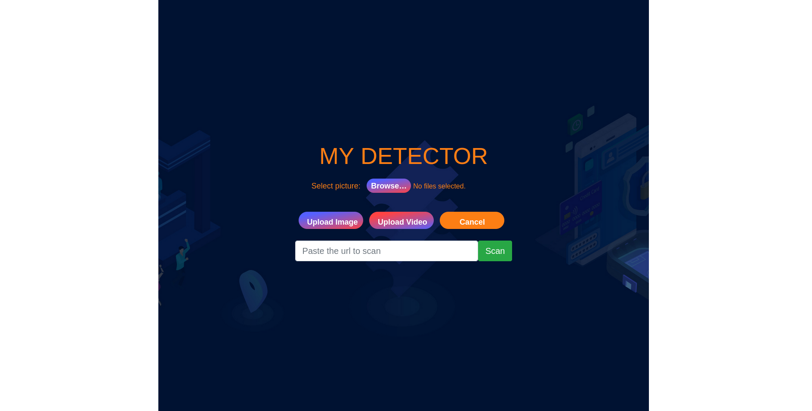
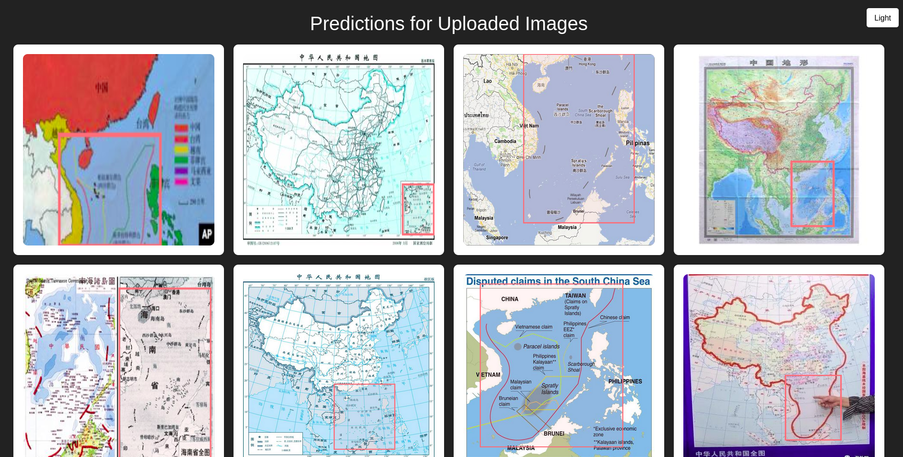

<h1 align="center">HOW TO IMPLEMENT A DEEPLEARNING MODEL INTO SERVER</h1>

<h2 align="center">DETECTING NINE DASH LINE IN IMAGES OR VIDEO</h2>

Code structure

<table>
  <thead>
    <tr>
      <th scope="col">folder</th>
      <th scope="col">description</th>
    </tr>
  </thead>
  <tbody>
    <tr>
      <td>config</td>
      <td>Config message broker, http request and view engine</td>
    </tr>
    <tr>
      <td>controller</td>
      <td>Handle get and post mehthod</td>
    </tr>
    <tr>
      <td>middleware</td>
      <td>Express middleware</td>
    </tr>
    <tr>
      <td>provider</td>
      <td>Helper function</td>
    </tr>
    <tr>
      <td>route</td>
      <td>Routing and define endpoint</td>
    </tr>
    <tr>
      <td>service</td>
      <td>All deep learning logic go here</td>
    </tr>
    <tr>
      <td>views</td>
      <td>Create temporary UI</td>
    </tr>
  </tbody>
</table>

Setup guide

Linux

If you only want to run the server and enjoy the results, just execute the command:
<ul>
  <li><b>make image</b></li>
  <li><b>make up</b></li>
</ul>
If you want to modify the code according to your preference, please follow these steps:
<ul>
  <ul>
    <li><b>npm install</b></li>
  </ul>
  <ul>
    <li><b>make image</b></li>
    <li>
      change this path: <b>/home/long1100/temp</b> in `docker-compose.yaml/volumes section` to absolute path to the folder you just clone,
      because code in container and code in cloned folder are not the same so you need to mount it into container. When you change your code, code in container auto change
    </li>
    <li>Run command: <b>make rabbit</b></li>
    <li>Run command: <b>make container</b></li>
  </ul>
  
 
</ul>
