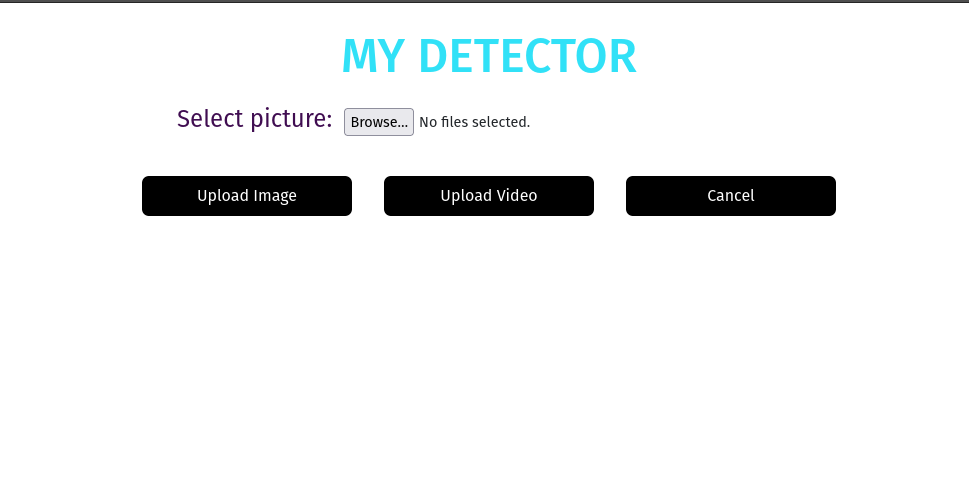
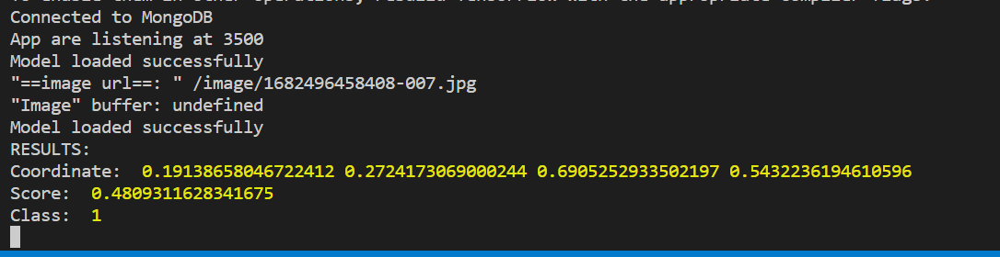

<h1 align="center">HOW TO IMPLEMENT A DEEPLEARNING MODEL INTO SERVER</h1>

<h2 align="center">DETECTING NINE DASH LINE IN IMAGES OR VIDEO</h2>

Code structure

<table>
  <thead>
    <tr>
      <th scope="col">folder</th>
      <th scope="col">description</th>
    </tr>
  </thead>
  <tbody>
    <tr>
      <td>config</td>
      <td>Config database, http request and view engine</td>
    </tr>
    <tr>
      <td>controller</td>
      <td>Handle get and post mehthod</td>
    </tr>
    <tr>
      <td>middleware</td>
      <td>Express middleware</td>
    </tr>
    <tr>
      <td>model</td>
      <td>Schema</td>
    </tr>
    <tr>
      <td>route</td>
      <td>Routing and define endpoint</td>
    </tr>
    <tr>
      <td>service</td>
      <td>All deep learning logic go here</td>
    </tr>
    <tr>
      <td>views</td>
      <td>Create temporary UI</td>
    </tr>
  </tbody>
</table>

Setup guide

OS
<ul>
  <li>Window</li>
  <ul>
    <li>Run command: make image</li>
    <li>
      change this path: <b>/home/long1100/temp</b> in `docker-compose.yaml/volumes section` to absolute path to the folder you just clone,
      because code in container and code in cloned folder are not the same so you need to mount it into container. When you change your code, code in container auto change
    </li>
    <li>remove volumes section in image mongo if you don't need it</li>
    <li>Run command: make up</li>
    <li>Need to dockerize because canvas and sharp library can't run at the same time in window</li>
  </ul>
  <li>Linux or Mac</li>
  <ul>
    <li>npm install</li>
  </ul>
</ul>
