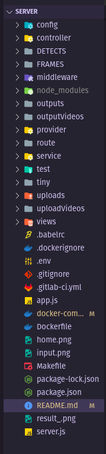

<h1 align="center">HOW TO IMPLEMENT A DEEPLEARNING MODEL INTO SERVER</h1>

<h2 align="center">DETECTING NINE DASH LINE IN IMAGES OR VIDEO</h2>

  
Code structure

  
<table>
  <thead>
    <tr>
      <th scope="col">folder</th>
      <th scope="col">description</th>
    </tr>
  </thead>
  <tbody>
    <tr>
      <td>config</td>
      <td>Config message broker, http request and view engine</td>
    </tr>
    <tr>
      <td>controller</td>
      <td>Handle get and post method</td>
    </tr>
    <tr>
      <td>middleware</td>
      <td>Express middleware</td>
    </tr>
    <tr>
      <td>provider</td>
      <td>Helper function</td>
    </tr>
    <tr>
      <td>route</td>
      <td>Routing and define endpoint</td>
    </tr>
    <tr>
      <td>service</td>
      <td>All deep learning logic go here</td>
    </tr>
    <tr>
      <td>views</td>
      <td>Create temporary UI</td>
    </tr>
  </tbody>
</table>

Setup guide

Linux OS

Make sure you have Node v18x or higher, docker and docker-compose

<b>git clone https://github.com/19521791/server-nodejs</b>

<b>cd server-nodejs</b>

If you only want to run the server and enjoy the results, just execute the command:
<ul>
  <li><b>make up</b></li>
</ul>
If you want to modify the code according to your preference, please follow these steps:
<ul>
  <ul>
    <li><b>npm install</b></li>
  </ul>
  <ul>
    <li>
      Uncomment volumes section in docker-compose file
    </li>
    <li>Change <b>/home/long1100/server</b> in docker-compose.yaml/volumes section to absolute path to the folder you just clone.</li>
    <li><b>make up</b></li>
  </ul>
</ul>

NOTE: If you encounter an error related to ffmpeg while detecting with a video, it may be because the two folders "DETECTS" and "FRAMES" are missing when pushing. These are two temporary folders used to store the extracted frames. Please create the "DETECTS" folder and the "FRAMES" folder using the commands <b>mkdir DETECTS</b> and <b>mkdir FRAMES</b> respectively.

I'm sorry for forgetting to adjust the mapping port and publish port to match each other when building the image. Therefore, please search in your browser for <b>localhost:8080</b>

